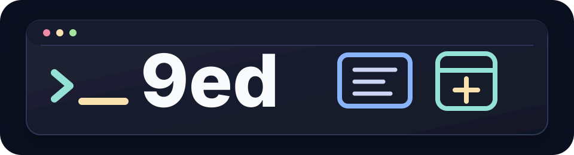
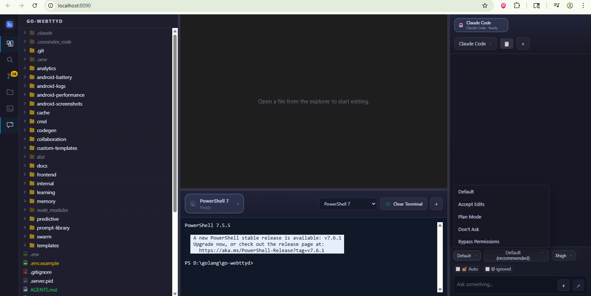
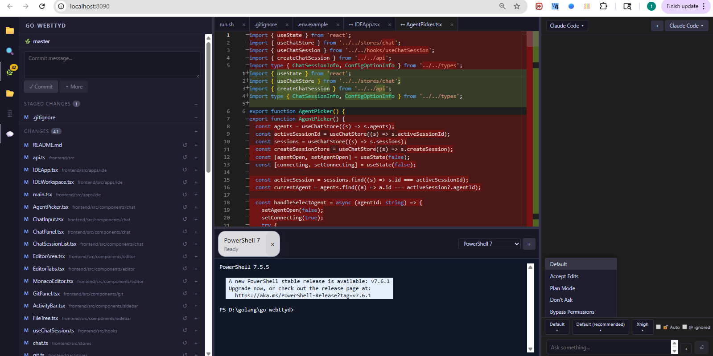
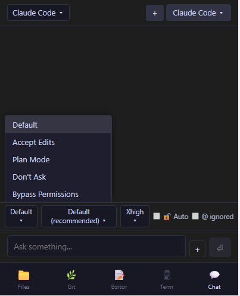
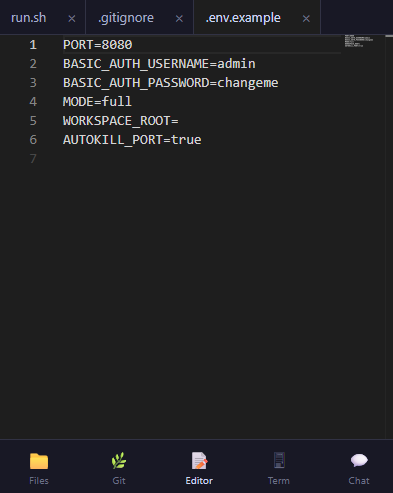

<p align="center">
  
</p>

<h1 align="center">9ed</h1>

<p align="center">
  <strong>One browser tab for code, terminals, git, agents, and live browser inspection.</strong>
</p>

<p align="center">
  <a href="#quick-start">Quick Start</a>
  |
  <a href="#features">Features</a>
  |
  <a href="#release-binaries">Release Binaries</a>
  |
  <a href="#development">Development</a>
</p>

<p align="center">
  
  
  
  
</p>

9ed is a self-hosted browser IDE designed for agent-assisted development. It combines a Monaco editor, PTY terminals, git source control, ACP-powered AI chat, and an inspectable in-app browser into one responsive workspace.

It runs as a normal Go server during development and can also be shipped as a single embedded binary for releases.

## Why 9ed?

| Focus | What it gives you |
|-------|-------------------|
| Local-first control | Your workspace, terminal sessions, git operations, and browser tools stay behind your own server and Basic Auth. |
| Agent-ready workflow | AI chat can see terminal context, route commands into the active terminal, and attach inspected browser elements to prompts. |
| Portable delivery | Production builds can embed the frontend into the Go binary, leaving only the binary and `.env` to deploy. |

## Preview




## Features

### Terminal
- PTY-backed terminal sessions managed by a Go backend
- Multi-tab terminal UI using xterm.js
- Cross-platform shell detection (PowerShell, cmd, Git Bash, WSL, bash, zsh)

### IDE Mode (Full)
- Monaco Editor with multi-tab file editing
- File explorer with tree navigation and context menu (New, Rename, Delete, Copy, Cut, Paste)
- Full-text search across project files
- Multi-project workspace support
- Real-time file watcher (auto-sync on external changes)
- Workspace state persistence (open tabs, active file restored on reopen)
- Vue & Svelte syntax highlighting
- .gitignore-aware file dimming in explorer

### Git Source Control
- Full git panel: status, stage/unstage, commit, push, pull
- Branch management: create, switch, delete, merge
- Stash support: save, pop, apply, drop
- Commit history with pagination
- Diff view (Monaco DiffEditor, side-by-side) - click any changed file to see diff
- Git gutter decorations (green=added, blue=modified, red=deleted)
- File-level discard changes
- Change count badge on activity bar icon
- Untracked files show full content as added (green)

### AI Chat (ACP Protocol)
- **ACP (Agent Client Protocol)** - structured JSON-RPC 2.0 communication with AI agents
- Supports: OpenCode, Claude Code, Codex CLI, Gemini, Pi, Amp, GitHub Copilot
- Auto-install ACP adapters (npm) when agent is selected
- Dynamic model picker, mode/agent selector, thinking level - all from ACP `configOptions`
- Slash command autocomplete from `available_commands_update`
- Streaming responses with markdown rendering
- Tool call visualization (read, edit, search, execute) with collapsible details
- Plan/todo tracking with progress indicators
- Thinking/reasoning display (collapsible)
- Diff view for file changes made by agent
- Auto-title sessions from first message or agent-generated title
- PTY fallback for agents without ACP adapter
- **Permission dialog** - approve/reject tool calls (ACP `session/request_permission`)
- **Auto-approve mode** - skip permission prompts for trusted environments
- **Message queue** - type and queue messages while agent is streaming
- **@ file mentions** - reference any project file with autocomplete (filename + directory path)
- **Voice input** - dictate messages via Web Speech API with microphone access handling

### Terminal <-> Chat Integration
- **Bidirectional terminal context**: AI agent receives live terminal scrollback as context
- **Active terminal routing**: agent terminal commands execute directly in the active terminal session
- **"Run in terminal" button**: shell code blocks in chat messages can be executed with one click
- **Terminal-aware AI**: agent knows shell type (PowerShell, bash, zsh) and adapts commands
- **Terminal scrollback replay**: backend buffers terminal output for reconnection and AI context
- **Terminal tabs per project**: terminal state persisted in workspace, survives navigation

### Browser Inspect (Element Inspector for AI)
- **4-layer box model overlay**: margin, border, padding, content - color-coded canvas rendering
- **Smart hit-test**: click any element in browser panel to inspect
- **Rich tooltip**: shows tag, id, classes, dimensions, CSS properties
- **Keyboard navigation**: Tab/Shift+Tab between elements, Escape to exit
- **AI context injection**: selected element details auto-attached to chat messages
- **Mini inspect panel**: Styles, Events, Accessibility tabs for selected element
- **Ruler lines**: visual guides from selected element to viewport edges




### Responsive Layout
- **Consistent state across all form factors** - desktop, tablet, and mobile share the same Zustand state
- **Desktop** (>=1024px): Full panel layout with resizable sidebar, editor, terminal, chat
- **Tablet** (768-1023px): Overlay sidebar and chat panels
- **Mobile** (<768px): Single-panel view with bottom navigation
- Responsive layout mode changes preserve panel state - no remounting or data loss
- File/git click auto-switches to editor view on mobile/tablet
- Floating save button on mobile/tablet

### Editor Features
- Context menu on tabs: Close, Close Others, Close Left/Right, Close All, Copy Path
- Context menu on files: New File/Folder, Cut, Copy, Paste, Duplicate, Rename, Delete
- Conflict detection: "File changed on disk" bar with Overwrite/Revert options
- Deleted file detection: indicator + Recreate/Close options
- External change auto-reload (when no unsaved edits)

### Security
- Basic Auth protection for UI, API, and WebSocket
- Session cookie bridge for WebSocket authentication
- Path traversal protection for filesystem operations

### Browser Proxy
- In-app browser panel with tab management
- Full URL rewriting (HTML, CSS, JS, fetch, XHR, EventSource)
- MutationObserver-based dynamic resource rewriting (script, link, iframe, img)
- JavaScript property descriptor interception (HTMLScriptElement.src, HTMLLinkElement.href)
- Service worker registration stubbing for proxied pages
- Cross-tab navigation via postMessage protocol

### Tunnel
- Auto-start tunnel for public access - no manual setup needed
- **Cloudflare** (default): Quick tunnel via `cloudflared`, generates random public URL
- **Bore**: Fixed port tunnel via `bore.pub`, auto-installs binary
- Toggle with `TUNNEL=true/false`, select engine with `TUNNEL_ENGINE=cloudflare|bore`
- **Auto-restart watchdog**: tunnel process auto-restarts on crash
- **Graceful shutdown**: clean process termination with timeout
- **Output recording**: tunnel logs captured for diagnostics
- Auto-shutdown on server exit

## Requirements

- Go 1.24+
- Node.js 20+
- Git (for source control features)
- Optional: OpenCode, Claude Code, Codex CLI, Gemini, Pi, Amp (for AI chat)

## Quick Start

```bash
cp .env.example .env
# Edit .env with your credentials
npm run start
# Open http://localhost:8080
```

## Scripts

| Command | Action |
|---------|--------|
| `npm run start` | Install deps + build frontend + run server |
| `npm run server` | Run Go server only (dev) |
| `npm run dev` | Vite dev server (frontend hot reload) |
| `npm run build` | Build frontend |
| `npm run server:build` | Compile Go binary |
| `npm run binary:build` | Build frontend and embed it into a single Go binary |
| `npm run check` | TypeScript typecheck + Go vet |
| `npm run go:test` | Run all Go tests |
| `npm run go:build` | Build all Go packages |
| `npm run typecheck` | TypeScript typecheck only |

## Release Binaries

Release binaries are built with the frontend embedded into the Go executable.

```bash
npm run binary:build
```

For a deployed release, keep the generated binary next to a `.env` file with `BASIC_AUTH_USERNAME`, `BASIC_AUTH_PASSWORD`, and any runtime options you need. The server will serve the embedded app first and fall back to `dist/` only for local development builds.

## Environment Variables

| Variable | Description | Default |
|----------|-------------|---------|
| `PORT` | HTTP listen port | `8080` |
| `BASIC_AUTH_USERNAME` | Required username | required |
| `BASIC_AUTH_PASSWORD` | Required password | required |
| `MODE` | `simple` (terminal only) or `full` (IDE) | `simple` |
| `WORKSPACE_ROOT` | Default workspace directory | cwd |
| `AUTOKILL_PORT` | Kill existing process on port before start | `true` |
| `TUNNEL` | Auto-start tunnel for public access | `true` |
| `TUNNEL_ENGINE` | `cloudflare` (random URL via cloudflared) or `bore` (fixed port via bore.pub) | `cloudflare` |
| `USE_BROWSER` | Enable in-app browser panel | `false` |
| `TERMINAL_AI_MAX_LINES` | Max terminal lines sent to AI as context | `100` |
| `DEBUG` | Enable verbose debug logging | `false` |
| `DEBUG_WATCHER` | Enable watcher-specific debug logs (requires `DEBUG=true`) | `false` |

## AI Agent Support

| Agent | ACP Support | Auto-Install | Fallback |
|-------|-------------|--------------|----------|
| OpenCode | Native (`opencode acp`) | Built in | PTY |
| Claude Code | Via adapter (`claude-agent-acp`) | `npm i -g @agentclientprotocol/claude-agent-acp` | PTY |
| Codex CLI | Via adapter (`codex-acp`) | `npm i -g @zed-industries/codex-acp` | PTY |
| Gemini | Native (`gemini --experimental-acp`) | Built in | PTY |
| Pi | Via adapter (`pi-acp`) | `npm i -g pi-acp` | PTY |
| Amp | Via adapter (`amp-acp`) | `npm i -g amp-acp` | PTY |
| GitHub Copilot | Via adapter (`github-copilot-cli`) | `npm i -g github-copilot-cli` | None |

ACP adapters are auto-installed when you select an agent for the first time. No manual setup needed.

## Keyboard Shortcuts

| Shortcut | Action |
|----------|--------|
| `Ctrl+B` | Toggle sidebar |
| `` Ctrl+` `` | Toggle terminal |
| `Ctrl+Shift+G` | Open git panel |
| `Ctrl+Shift+L` | Toggle chat panel |
| `F1` | Show keyboard shortcuts |
| `Ctrl+S` | Save file |
| `Ctrl+Shift+I` | Inline AI prompt (select code first) |
| `F2` | Rename file (in explorer) |
| Right-click | Context menu (explorer, tabs) |

## Project Structure

```
cmd/server/            - Application entry point (autokill, config)
internal/
  config/              - .env loading and validation
  auth/                - Basic Auth middleware + session cookies
  shells/              - OS-aware shell discovery
  terminal/            - PTY session spawning and management
  filesystem/          - File operations with path security (recursive copy)
  watcher/             - Real-time file watcher (fsnotify)
  git/                 - Git CLI wrapper (status, log, branch, diff, stash, blame, check-ignore)
  chat/
    acp/               - ACP client (JSON-RPC 2.0 over stdio)
      protocol.go      - ACP message types and constants
      client.go        - JSON-RPC transport (request correlation, notifications)
      adapter.go       - Subprocess lifecycle + high-level ACP methods
    acpinstall/        - Auto-install ACP adapters via npm/pip
    agentconfig/       - Agent config file detection (models, providers)
    agent.go           - Unified ChatSession interface (ACP + PTY + permission handling)
    pty_session.go     - PTY fallback implementation
    session_manager.go - Session lifecycle management
    store.go           - SQLite persistence (chat history, workspace state, recent projects)
  httpapi/             - REST API + WebSocket handlers
  server/              - HTTP assembly and static serving
  tunnel/              - Tunnel subprocess lifecycle (bore, cloudflare)
frontend/src/
  apps/ide/            - IDE mode entry (workspace, project picker)
  apps/terminal/       - Simple terminal mode
  config/              - Monaco editor setup (TS/JS diagnostics, Vue/Svelte languages)
  components/
    editor/            - Monaco editor, diff view, tabs with context menu
    git/               - Git panel, status list, branch picker, stash, diff view
    chat/              - Chat panel, messages, input, agent picker, permission dialog, queue, voice
    browser/           - Browser panel, inspect overlay, element selection, hit-test
    sidebar/           - Activity bar (with badge), file tree (with context menu), search
    terminal/          - Terminal panel (xterm.js), tabs per project
    shared/            - Bottom nav, shortcuts help, context menu
  stores/              - Zustand state (workspace, git, chat)
  hooks/               - Custom hooks (git status, gutter, chat, layout, workspace persistence)
  terminalConnection.ts - WebSocket lifecycle for terminal sessions
  terminalRegistry.ts  - Terminal handle registry (write/paste for chat-to-terminal routing)
  terminalIntegration.ts - Shell language detection and command sanitization
```

## Development

```bash
# Run Go server (backend only)
npm run server

# Run frontend dev server (hot reload, proxy to Go backend)
npm run dev

# Run all checks
npm run check

# Run all Go tests
npm run go:test

# Build everything for production
npm run start
```
